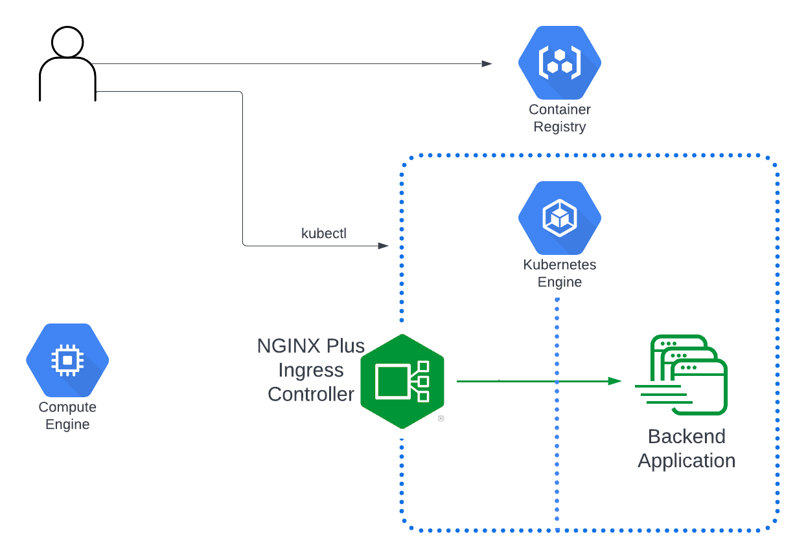

# GCP Cluster and NIC Deployment
This section details how to setup a GKE (Google Kubernetes Engine) Cluster and Nginx Plus Ingress Controller on that cluster.

## Client Prerequisites
* Docker client
* latest version of [kubectl](https://kubernetes.io/docs/tasks/tools/)
* latest version of [gcloud CLI](https://cloud.google.com/sdk/docs/install) (GCP CLI to create the cluster)
Ensure that you have enabled the Google Kubernetes Engine API. 
Ensure you have the correct permission to create clusters. At minimum, you should be a Kubernetes Engine Cluster Admin.

## Architecture
This is what we will be deploying:



## Create & Configure Cluster
Create a GKE cluster with the specified instance sizing in your default region. Resources that live in a zone are referred to as zonal resources. Virtual machine Instances and persistent disks live in a zone. To attach a persistent disk to a virtual machine instance, both resources must be in the same zone. Similarly, if you want to assign a static IP address to an instance, the instance must be in the same region as the static IP. 

Use `gcloud init`, if you want to be walked through setting project defaults.

Use `gcloud config`, to individually set your project ID, zone, and region.

Can specify the region with `--region` flag:

`gcloud container clusters create CLUSTER_NAME \ --project projectName \ --region COMPUTE_REGION \ --cluster-version VERSION`

Note: By setting default locations, you can avoid errors in gcloud CLI like the following: `One of [--zone, --region] must be supplied: Please specify location`. 

```
gcloud container clusters create my-regional-cluster \
    --project projectName \
    --region us-east1 \
    --node-locations us-east1-b \
    --num-nodes 2
```

You may set it for your current workspace by running:

  `$ gcloud config set project VALUE`

To get cluster names:

`gcloud container clusters list`

At this point you should be able to get the nodes with kubectl:
```
$ gcloud container node-pools list --cluster my-regional-cluster --region us-east1
```

The response should list two running nodes (or however many nodes you set with --num-nodes above).


## Access & Authorization
You can use both Identity and Access Management (IAM) and Kubernetes RBAC to control access to your GKE cluster:

IAM is not specific to Kubernetes; it provides identity management for multiple Google Cloud products, and operates primarily at the level of the Google Cloud project.

Kubernetes RBAC is a core component of Kubernetes and lets you create and grant roles (sets of permissions) for any object or type of object within the cluster.

In GKE, IAM and Kubernetes RBAC are integrated to authorize users to perform actions if they have sufficient permissions according to either tool. This is an important part of bootstrapping a GKE cluster, since by default Google Cloud users do not have any Kubernetes RBAC RoleBindings.

To authorize users using Google Cloud accounts, the client must be correctly configured to authenticate using those accounts first. For example, if you are using kubectl, you must configure the kubectl command to authenticate to Google Cloud before running any commands that require authorization.

Note: To perform this step you must be a cluster admin. Follow the documentation of your Kubernetes platform to configure the admin access.

Clone the Ingress controller repo and change into the deployments folder:
```
$ git clone https://github.com/nginxinc/kubernetes-ingress/
$ cd kubernetes-ingress/deployments
$ git switch -c v2.1.2
```

You can change the service account name and namespace but you would then need to propagate those changes to some of the upcoming charts. If you use `nginx-ingress` all of the charts that reference the service account or namespace will work as is.

Create a namespace and a service account for the Ingress controller:

`$ kubectl apply -f common/ns-and-sa.yaml`

Edit lines 104/105 in `rbac.yaml` to match your service account name and namespace if you changed them from the default `nginx-ingress`

Create a cluster role and cluster role binding for the service account:

`$ kubectl apply -f rbac/rbac.yaml`

Create a config map for customizing NGINX configuration:

`$ kubectl apply -f common/nginx-config.yaml`

Create an IngressClass resource:

`$ kubectl apply -f common/ingress-class.yaml`
If you would like to set the Ingress Controller as the default one, uncomment the annotation ingressclass.kubernetes.io/is-default-class. With this annotation set to true all the new Ingresses without an ingressClassName field specified will be assigned this IngressClass.

Note: The Ingress Controller will fail to start without an IngressClass resource.

Create Custom Resources
Note: By default, it is required to create custom resource definitions for VirtualServer, VirtualServerRoute, TransportServer and Policy. Otherwise, the Ingress Controller pods will not become Ready. If you’d like to disable that requirement, configure -enable-custom-resources command-line argument to false and skip this section.

Create custom resource definitions for VirtualServer and VirtualServerRoute, TransportServer and Policy resources:

```
$ kubectl apply -f common/crds/k8s.nginx.org_virtualservers.yaml
$ kubectl apply -f common/crds/k8s.nginx.org_virtualserverroutes.yaml
$ kubectl apply -f common/crds/k8s.nginx.org_transportservers.yaml
$ kubectl apply -f common/crds/k8s.nginx.org_policies.yaml
```

For NGINX Ingress Controller, you must have the NGINX Ingress Controller subscription – download the NGINX Plus Ingress Controller (per instance) JWT access token from 

Create a docker-registry secret on the cluster using the JWT token as the username, and none for password (password is unused). The name of the docker server is private-registry.nginx.com
`kubectl create secret docker-registry regcred --docker-server=private-registry.nginx.com --docker-username=<JWT Token> --docker-password=none --namespace=nginx-ingress`

Confirm the details of the created secret by running:

`kubectl get secret regcred --output=yaml`

## Create Load Balancer & Allow Traffic

Creates an Load Balancer in GCP with a LoadBalancer type Service routes all HTTP/HTTPS traffic (80/443) from the Load Balancer to the `nginx-ingress` app which we haven't created yet:

`kubectl apply -f loadbalancer.yaml`

Applies some Nginx config values including what traffic is allowed to the LoadBalancer. Needs to be applied after the LoadBalancer Service is created allow traffic through it:

`kubectl apply -f nginx-config.yaml`

To retrieve the public endpoint for the service we just created:

`kubectl get svc -n nginx-ingress`

## Push Image to GCR & Deploy NIC Plus

Now we've deployed everything we need except the ingress controller itself.  We need to publish the NIC Plus image to GCR and then reference it in the `nginx-plus-ingress.yaml` before we can apply the chart.

There are  to publish the licensed image.  

It is also possible to build your own image and push it to your private Docker registry by following the instructions from 


First, configure the Docker environment to use certificate-based client-server authentication with the F5 Container registry - private-registry.nginx.com. To do so in a Linux based environment, create a private-registry.nginx.com directory under /etc/docker/certs.d and create a certificate client.cert (using nginx-repo.crt - please note that the certificate MUST have the .cert suffix, not .crt) and a key client.key (using nginx-repo.key). 

```
mkdir -p /etc/docker/certs.d/private-registry.nginx.com

cp nginx-repo.crt /etc/docker/certs.d/private-registry.nginx.com/client.cert`

cp nginx-repo.key /etc/docker/certs.d/private-registry.nginx.com/client.key
```

Use Docker to pull the required image from private-registry.nginx.com. For NGINX Plus Ingress Controller, pull from private-registry.nginx.com/nginx-ic/nginx-plus-ingress. For example

`docker pull private-registry.nginx.com/nginx-ic/nginx-plus-ingress:2.1.2`

Tag and push the image to your private registry.

```
docker tag private-registry.nginx.com/nginx-ic/nginx-plus-ingress:2.1.2 gcr.io/<project>/nginx-plus-ingress:2.1.2`

docker push gcr.io/<project>/nginx-plus-ingress:2.1.2
```

Copy the image name into Line 21 of `nginx-plus-ingress.yaml`.  It will look something like this: `gcr.io/<Project>/nginx-ic/nginx-plus-ingress:2.1.2`

If you used a different Service Account name than the default `nginx-ingress`, change it on Line 19.

Now we're ready to create the ingress controller DaemonSet:

`kubectl apply -f nginx-plus-ingress.yaml`

You should see one ingress running for each of your nodes:

```
$ kubectl get pods -n nginx-ingress -o wide
NAME                             READY   STATUS    RESTARTS   AGE
nginx-ingress-6b5d5f956d-ccjlc   1/1     Running   0          7s
```

Run `kubectl describe ds -n nginx-ingress` if you see something different than the above to diagnose the issue.

Create a service using a manifest for your cloud provider:

`kubectl apply -f service/loadbalancer.yaml`


To test, get the EXTERNAL-IP for the LoadBalancer service that we created earlier:

```
$ kubectl get svc -n nginx-ingress
NAME            TYPE           CLUSTER-IP    EXTERNAL-IP     PORT(S)                      AGE
nginx-ingress   LoadBalancer   10.4.15.149   35.237.176.61   80:31049/TCP,443:31720/TCP   2m6s
```

Visit the endpoint in your browser and you should be taken to the default 404 page hosted by your new ingress controller.

## Hosts File

To determine the IP Addresses add to your hosts file on your computer, run the following:

`dig <External-IP>`

You should get a list of IP addresses in the `;; ANSWER SECTION:` that you can map to the appropriate endpoints.

This example lists all the endpoints used in other sections of this repo:

```
#
1.1.1.2 1.1.2.3 1.2.3.4 cafe.ingress.demo dashboard.ingress.demo bar.ingress.demo grafana.ingress.demo prometheus.ingress.demo
```